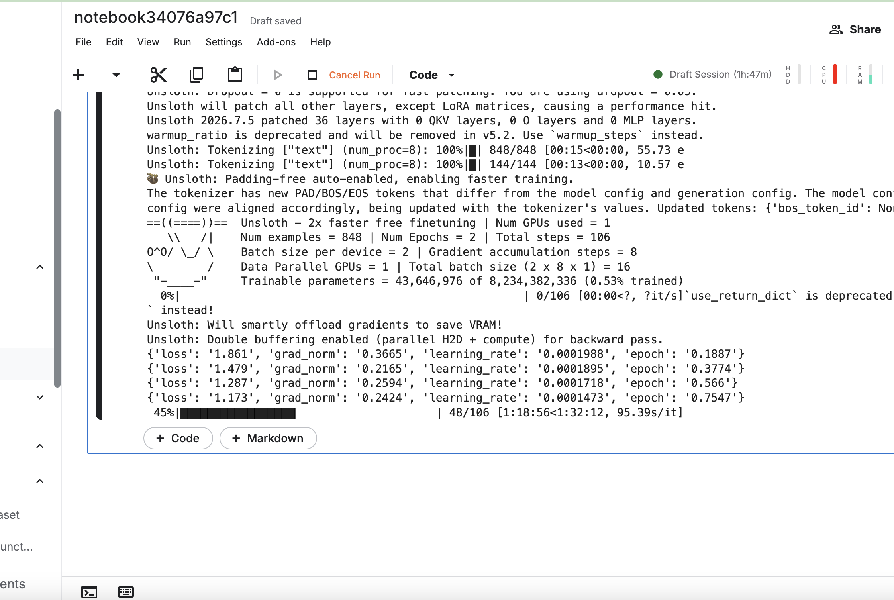
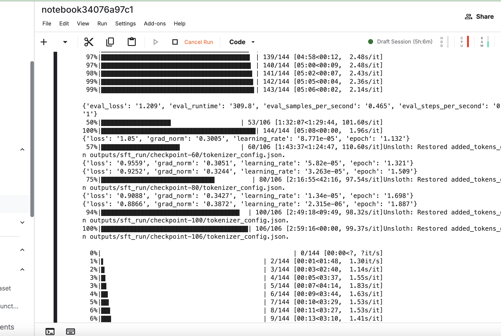

# منهاجي — Arabic Curriculum Fine-Tuning

Production-grade LLM specialization pipeline for Arabic curriculum content generation. Part of a portfolio triad: RAG ([agentic_graph_rag](https://github.com/umerjavaidkh)) · Agents · **Fine-Tuning (this repo)**.

RAG retrieves curriculum context; this fine-tuned model generates in-style, indicator-aligned educational artifacts (exams, worksheets, lesson plans, vocabulary activities, grammar explanations) grounded in that context. See [`finetuning-blueprint.md`](finetuning-blueprint.md) for the full design.

## How It Works

The goal: take a curriculum textbook PDF and end up with a model that's good at writing exams, worksheets, and lesson plans in that book's exact style.

1. **Extraction — turn the PDF into clean text.** We pull text page by page and drop anything unusable: title pages, tables of contents, grading rubrics, and pages where the PDF's text layer is garbled (would need OCR). In one book, 186 of 239 pages passed this quality gate. Each surviving chunk of text is tagged with its unit/lesson.

2. **Dataset (candidate) building — figure out what to ask for.** For each usable page we look at what's there (learning objectives, vocabulary lists, grammar rules, time estimates) and decide what kind of teaching material it could become — an exam, a worksheet, a set of questions tied to a learning objective, a lesson plan, a grammar explanation, or a vocabulary activity. This turns pages into ~500 "candidates," each one an instruction like "using this context, write an exam."

3. **Generation (the "teacher") — have a smarter/cheaper model write the answer.** Each candidate is sent to GPT-4o-mini (the teacher model), which writes the actual exam/worksheet/etc. using only the given curriculum context — nothing invented. This produces the raw (context → generated content) training pairs.

4. **Judge — quality control before anything is trusted.** Every generated pair is scored by another LLM call acting as a strict grader, on 5 criteria (language correctness, curriculum fidelity, structural adherence, level calibration, usability). Anything below the bar is rejected. Final acceptance rates: 69.5% and 66.1% across the two books — roughly a third of what the teacher generated wasn't good enough to train on.

5. **Dataset assembly — split into train vs. test fairly.** Judge-accepted pairs from both books are combined, then a held-out set is carved out for testing — by *lesson*, not randomly, so the model can't "cheat" by seeing 90% of a lesson during training and being tested on the other 10%. Result: 848 training examples, 20 held-out validation examples never seen during training.

6. **Training — actually teach the model.** A general-purpose model (Qwen3-8B) is fine-tuned using QLoRA, a lightweight technique that only trains a small set of "adapter" weights instead of the whole model, so it fits on a free Kaggle GPU. It runs through the 848 examples twice (2 epochs), with loss dropping from 1.86 to 0.89.

7. **Validation / evaluation — did it actually get better?** Both the original base model and the fine-tuned model generate answers on the same 20 held-out prompts, and the judge scores both, blind. Result: 9 wins / 3 ties / 8 losses for the fine-tuned model — a mixed, not a clean-sweep result (see [Evaluation](#evaluation) below for why, including a real memorization-vs-generalization finding).

## Status

- [x] Dataset-prep pipeline: PDF extraction → quality gating → SFT candidate building → teacher-model generation → LLM-judge scoring, 75 unit tests
- [x] Validated end-to-end on 2 real books → 593 quality-gated training pairs (69.5% and 66.1% judge-acceptance rates)
- [x] Training: QLoRA fine-tune of Qwen3-8B on Kaggle (T4×2), 2 epochs, 848 training examples — see [Training Run](#training-run) below
- [x] Evaluation: base vs. fine-tuned, judge-scored on 20 held-out prompts — see [Evaluation](#evaluation) below
- [ ] Model + adapter published to Hugging Face

## Training Run

QLoRA (r=16) fine-tune of `Qwen/Qwen3-8B`, run on a Kaggle T4×2 kernel per `configs/sft.yaml`. 106 steps over 2 epochs, `train_loss` 1.15, held-out `eval_loss` improved epoch-over-epoch (1.209 → 1.192).

| Start | End |
|---|---|
|  |  |

Checkpointed every 20 steps for resumability; final adapter saved to `outputs/sft_run/`.

## Evaluation

Base `Qwen/Qwen3-8B` vs. the fine-tuned adapter, both generating on the same 20 held-out prompts (excluded from training via the held-out-by-lesson split), judged blind on the same 5-criterion rubric used to filter the training data (`eval/rubric.md`).

| Criterion | Base | Fine-tuned | Δ |
|---|---|---|---|
| Language correctness | 4.00 | 3.35 | −0.65 |
| Curriculum fidelity | 4.50 | 5.00 | +0.50 |
| Structural adherence | 3.25 | 3.80 | +0.55 |
| Level calibration | 4.65 | 4.50 | −0.15 |
| Usability | 4.15 | 4.30 | +0.15 |

**Win / tie / loss** (fine-tuned vs. base, by overall average): 9 wins, 3 ties, 8 losses.

Mixed, honest result — not a clean sweep, which is the expected shape for a 2-epoch fine-tune on fewer than 900 examples. The real, structural story: base `Qwen3-8B` emits a `<think>...</think>` reasoning block by default, which frequently consumed most of the generation budget and left the actual answer truncated mid-sentence. Fine-tuning (on targets that never contained visible reasoning) taught the model to emit an empty `<think></think>` and go straight to a complete, correctly-structured answer — this is exactly what shows up as the `structural_adherence` and `curriculum_fidelity` gains. The `language_correctness` regression is a real, unresolved caveat, most likely from the small training set introducing occasional grammatical rough edges; worth investigating before scaling up training data or claiming a win.

### Training vs. eval loss: a memorization signature

| Step | Train loss | Eval loss |
|---|---|---|
| Early | 1.861 | 1.209 |
| Final | 0.887 | 1.192 |

Train loss dropped by more than half (1.861 → 0.887) while eval loss on the held-out split barely moved (1.209 → 1.192, if anything drifting slightly worse). That gap is the textbook signature of memorization rather than generalization: the model is fitting the specific training examples increasingly well without getting better at producing correct output for lessons it hasn't seen. This tracks with the blueprint's own stated risk (§2.4) that a small, single-domain SFT set (~500 unique examples here, oversampled to 848 to fill the training budget) is prone to exactly this failure mode — there just isn't enough distinct signal for 2 epochs to generalize instead of memorize.

Practically, this means the win/tie/loss result above is likely close to the ceiling for this data volume — the fix is more unique curriculum coverage (more books/lessons), not more epochs on the same ~500 examples, and per-checkpoint eval (rather than judging only the final checkpoint) would help catch the point where memorization starts outpacing generalization.

## Pipeline

```bash
# Extract + generate + judge one book
python scripts/prepare_dataset.py --pdf <book>.pdf --grade-level <N> --generate --judge

# Combine accepted pairs from multiple books, held-out-by-lesson split for eval
python scripts/build_training_dataset.py \
  --book NAME1 path/to/book1_accepted.jsonl \
  --book NAME2 path/to/book2_accepted.jsonl \
  --held-out BOOK UNIT LESSON

# Train (run on a GPU, e.g. a Kaggle Script kernel)
python src/training/train_sft.py --config configs/sft.yaml
```

## Tests

```bash
python -m pytest tests/ -v
```

## IP note

Source curriculum PDFs and the full extracted/generated dataset are excluded from this repo (see `.gitignore`). Only pipeline code is public, plus a small illustrative sample — see [`data/sample/`](data/sample/) for 6 SFT training pairs and 3 base-vs-tuned eval comparisons with a full datacard (schema, filter stats, limitations, license note). No full book pages, chapters, or the source PDF are included anywhere in this repo.
